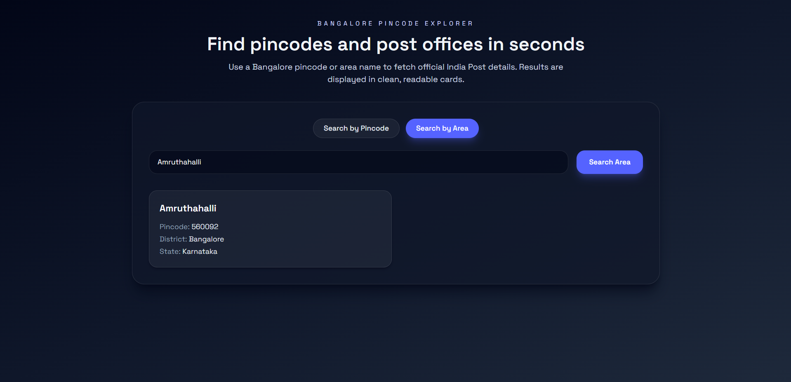

# Bangalore Pincode Explorer

Bangalore Pincode Explorer is a simple full-stack web app for Bangalore users to quickly find:

- Area name from a pincode
- Pincode from an area name

Users can enter either a Bangalore pincode or a Bangalore area/post office name, and the app will fetch and display the matching result using the India Post API in a clean and responsive UI.

## Tech Stack

- Frontend: React + Tailwind CSS + Vite
- Backend: Node.js + Express
- API calls: Axios

## Project Structure

```
frontend/
backend/
```

## Features

- Search by pincode or area/post office name
- Two clean tabs for switching modes
- Loading spinner and error states
- Responsive layout with result cards
- Basic validation to prevent bad requests

## Installation Steps

### 1) Backend setup

```bash
cd backend
npm install
cp .env.example .env
npm run dev
```

The backend runs at `http://localhost:5000` by default.

### 2) Frontend setup

```bash
cd frontend
npm install
cp .env.example .env
npm run dev
```

The frontend runs at `http://localhost:5173` by default.

Note: In development, the Vite dev server proxies `/api` requests to `http://localhost:5000`, so keep the backend running.

## API Routes

- `GET /api/pincode/:pin`
- `GET /api/area/:name`

## Environment Variables

### Backend

```
PORT=5000
INDIA_POST_API_BASE=https://api.postalpincode.in
```

### Frontend

```
VITE_API_BASE_URL=http://localhost:5000
```

## Commands to Run Locally

```bash
# backend
cd backend
npm run dev

# frontend
cd frontend
npm run dev
```

## Screenshots

